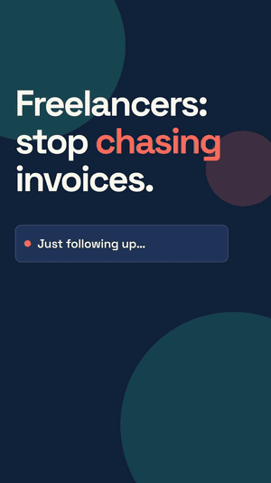

# /shortform

**Tell your coding agent what you want a video to achieve. Get a vertical video ready for TikTok, YouTube Shorts and Reels.**

[](https://github.com/Virtucon/shortform/actions/workflows/validate.yml)
[](LICENSE)
[](https://agentskills.io)

<p align="center">
  
</p>
<p align="center"><sub>Made with <code>/shortform attract freelancers as customers, TikTok, 25 seconds</code> · <a href="examples/paidly/shortform-output/shortform.mp4">watch with sound</a> · <a href="examples/paidly/shortform-output/post.md">the post kit it wrote</a></sub></p>

```
/shortform attract B2B customers for my invoicing app
```

`/shortform` is an open-source [agent skill](https://agentskills.io). It reads the project you are in, or just your brief, and makes one 1080×1920 video built around your objective: the hook, the structure and the call to action all follow from what you want the viewer to do.

## Install

**Claude Code**

```
/plugin marketplace add Virtucon/shortform
/plugin install shortform@shortform
```

**Codex, Cursor, Gemini CLI, OpenCode, Copilot and other agents**

```bash
npx skills add Virtucon/shortform
```

Add `-g` to install for every project. The [`skills` CLI](https://github.com/vercel-labs/skills) puts it in the right folder for each agent it finds.

**By hand**: copy `skills/shortform/` into your agent's skills folder (`~/.claude/skills/`, `~/.agents/skills/`, or whatever your agent reads).

### You also need

- [Node.js](https://nodejs.org) 22 or newer
- [FFmpeg](https://ffmpeg.org/download.html) on your `PATH`
- The [HyperFrames](https://github.com/heygen-com/hyperframes) skills, which do the rendering: `npx hyperframes skills update`

The skill checks all of this first and tells you what is missing. It never installs anything itself.

## Use it

Type the command, then say what the video is for in plain words. There are no flags to learn.

```
/shortform attract B2B customers for my invoicing app
/shortform 15 second TikTok, get devs to star the repo
/shortform grow followers, playful, part 1 of a series on our design system
/shortform announce the launch, use the screen recording in ./media/demo.mov
/shortform teach people how compound interest works (no project, just this)
```

| Agent | How to invoke |
|---|---|
| Claude Code, Cursor | `/shortform <brief>` |
| Codex | `$shortform <brief>` |
| Gemini CLI, OpenCode, others | "use shortform to …" or "make a TikTok about …" |

Things you can say in the brief:

| You can set | Example | If you don't |
|---|---|---|
| Objective | "attract customers", "get signups", "hire a designer" | it asks one question |
| Platform | "TikTok", "Shorts", "Reels" | one video, safe for all three |
| Length | "15 seconds" | 20–30s (never over 60) |
| Call to action | "CTA: join the waitlist" | chosen to fit the objective |
| Tone | "deadpan", "premium", "playful" | inferred from your project |
| Your media | "use ./media/demo.mov" | UI is rebuilt from your code |
| Music | "chill music", "use ./track.mp3", "no music" | a bundled track matched to the tone |
| Voiceover | "with voiceover" | off; captions carry the message |

Before the slow render it shows you three hook options and the storyboard, and waits for one reply. Say "just do it" in the brief to skip that.

### What you get

```
shortform-output/
  shortform.mp4    1080×1920, 30fps, ready to upload
  cover.jpg        a cover frame, picked on the hook
  post.md          caption, hashtags, Shorts title, per-platform notes, pre-post checklist
  plan.md          the storyboard and every decision made
  composition/     the HyperFrames project, if you want to edit and re-render
```

## What makes it short-form

A landscape launch video cropped to 9:16 does not work in a feed. `/shortform` plans for the feed from the start:

- **Objective first.** Eight playbooks (attract customers, drive signups, grow followers, educate, announce a launch, social proof, hire, build community), each with its own hook style, scene structure and call to action.
- **The hook is on frame 1.** No logo sting, no fade in. You pick from three hooks written in three different patterns.
- **Sound-off first.** Big kinetic captions carry the whole message. Music adds energy; it is never needed to understand the video.
- **Safe zones.** Every readable element stays clear of the username, caption, buttons and progress bar that TikTok, Shorts and Reels draw over your video.
- **Phone-sized type.** Minimum sizes, word limits per card, and hold times so text can be read.
- **Something changes every 2–3 seconds,** and cuts land on the beat of the music.
- **One call to action, then a loop.** The last frame cuts cleanly into the first, so rewatches count.
- **Nothing made up.** Every claim and number on screen is traced to your project or your brief in `plan.md`.

## How it works

1. **Preflight**: checks Node, FFmpeg, Chrome and the HyperFrames skills.
2. **Understand**: reads your README, landing page, styles and core flow for real copy, colours and fonts. No browser, no screenshots.
3. **Plan**: picks the playbook, writes three hooks and a storyboard, and asks you once.
4. **Compose**: builds a 1080×1920 [HyperFrames](https://hyperframes.heygen.com/) composition in HTML and CSS, with captions and music, and runs `hyperframes check`.
5. **Deliver**: renders, verifies size and length, picks the cover, and writes the post kit.

The skill is plain Markdown: a short [`SKILL.md`](skills/shortform/SKILL.md) and one [reference file](skills/shortform/references) per step, loaded only when needed. Read it; change it; it is meant to be forked.

## FAQ

**Does it post for me?** No. It makes the file and the copy. You upload.

**Can I use a trending sound?** Yes. Upload the video, add the sound in the app, and turn the original audio down. Or say "no music" in the brief.

**Does it work without a project?** Yes. Give it a topic and it makes a typographic video from your brief alone.

**Which models work?** Any model your agent runs that can follow a multi-step skill and write HTML. Stronger models make better-looking videos.

**Is the music safe to post?** The four bundled tracks are [CC0](skills/shortform/assets/music/CREDITS.md) (public domain).

## Contributing

Issues and pull requests are welcome, most of all "this video came out wrong" reports with the brief and a screenshot. See [CONTRIBUTING.md](CONTRIBUTING.md).

## Credits

- Inspired by [brag](https://github.com/latent-spaces/brag) by Shunit Haviv Hakimi, which showed how good a one-command project video can be.
- Rendering by [HyperFrames](https://github.com/heygen-com/hyperframes).
- Music by Of Far Different Nature, omfgdude, Emma_MA and congusbongus, via [OpenGameArt](https://opengameart.org), all CC0.

## License

[MIT](LICENSE)
