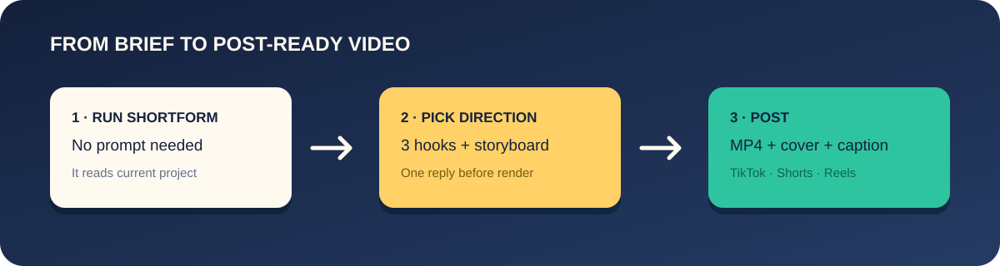

# /shortform

**One line in terminal. One vertical video, ready to post.**

`/shortform` reads project, writes hook, plans story, then renders a 1080×1920 video for TikTok, YouTube Shorts, and Reels. Output includes captions, music, cover frame, post copy, and hashtags.

[](https://github.com/Virtucon/shortform/actions/workflows/validate.yml)
[](LICENSE)
[](https://agentskills.io)

<p align="center"></p>

<p align="center">
  
</p>
<p align="center"><sub>Real example: <code>/shortform attract freelancers as customers, TikTok, 25 seconds</code> · <a href="examples/paidly/shortform-output/shortform.mp4">watch with sound</a> · <a href="examples/paidly/shortform-output/post.md">read post kit</a></sub></p>

## Quick start — no prompt needed

```bash
# Install for current project. Add -g for every project.
npx skills add Virtucon/shortform
```

Run it in project root:

```
/shortform
```

It reads project, then asks one question: **“What should this video achieve, and for whom?”** Answer in plain words. Then pick one of three hooks and storyboard. It renders while you do something else.

Want more control? Add brief after command. Fully optional:

```
/shortform attract B2B customers for my invoicing app
```

| I use | I type |
|---|---|
| Claude Code, Cursor | `/shortform` — add brief only if wanted |
| Codex | `$shortform` — add brief only if wanted |
| Gemini CLI, OpenCode, others | “use shortform” — add goal only if wanted |

No flags. No timeline. No stock footage, watermark, or AI avatar. Skill builds from real UI, colours, and copy when project exists.

Free. MIT. Runs on machine. Works with agent you already use.

**Status: early.** v0.2.0. End-to-end works; tested on handful of projects. Report rough edges.

## Install

**Claude Code**

```
/plugin marketplace add Virtucon/shortform
/plugin install shortform@shortform
```

**Codex, Cursor, Gemini CLI, OpenCode, Copilot and other agents**

```bash
npx skills add Virtucon/shortform
```

Add `-g` to install for every project. The [`skills` CLI](https://github.com/vercel-labs/skills) puts it in the right folder for each agent it finds.

**By hand**: copy `skills/shortform/` into your agent's skills folder (`~/.claude/skills/`, `~/.agents/skills/`, or whatever your agent reads).

### You also need

- [Node.js](https://nodejs.org) 22 or newer
- [FFmpeg](https://ffmpeg.org/download.html) (with `ffprobe`) on your `PATH`
- Chrome, which renders the frames: `npx hyperframes@0.8.46 browser ensure`
- A few GB of free disk — frames are extracted before the MP4 is written
- In Docker on Linux: `--shm-size=512m`, since Chrome needs more than the default 64MB `/dev/shm`
- The [HyperFrames](https://github.com/heygen-com/hyperframes) skills, which do the rendering: `npx hyperframes@0.8.46 skills update hyperframes-core hyperframes-animation hyperframes-creative hyperframes-keyframes hyperframes-cli`

The skill runs `hyperframes doctor` first and tells you exactly what is missing and the command that fixes it. It never installs anything itself.

**One thing to know about that dependency.** `/shortform` pins the HyperFrames CLI to `0.8.46`, but the HyperFrames *skills* above install from the upstream repository's `main` branch — there is no version to pin, and nothing records which state you got. Upstream changes to those skills can therefore change how your videos come out with no change in this repository. The pin is raised here deliberately, one pull request at a time; the skills underneath move on their own.

## Optional brief examples

Say goal in plain words:

```
/shortform attract B2B customers for my invoicing app
/shortform 15 second TikTok, get devs to star the repo
/shortform grow followers, playful, part 1 of a series on our design system
/shortform announce the launch, use the screen recording in ./media/demo.mov
/shortform teach people how compound interest works (no project, just this)
```

Brief can include:

| You can set | Example | If you don't |
|---|---|---|
| Objective | "attract customers", "get signups", "hire a designer" | it asks one question |
| Platform | "TikTok", "Shorts", "Reels" | one video, safe for all three |
| Length | "15 seconds" | 20–30s (30s is the cap; a longer request is capped and the plan says so) |
| Call to action | "CTA: join the waitlist" | chosen to fit the objective |
| Tone | "deadpan", "premium", "playful" | inferred from your project |
| Your media | "use ./media/demo.mov" | UI is rebuilt from your code |
| Music | "chill music", "use ./track.mp3", "no music" | a bundled track matched to the tone |
| Voiceover | "with voiceover" | off; captions carry the message |

Before render, it shows three hook options and storyboard. Say `just do it` to skip approval.

## Output

```
shortform-output/
  shortform.mp4    1080×1920, 30fps, ready to upload
  cover.jpg        a cover frame, picked on the hook
  post.md          caption, hashtags, Shorts title, per-platform notes, pre-post checklist
  plan.md          the storyboard and every decision made
  composition/     the HyperFrames project, if you want to edit and re-render
```

When it finishes it offers one re-roll — a different hook from the plan, a different length, or a different track. Or edit the composition yourself:

```bash
cd shortform-output/composition
npm run dev                      # live preview in the browser
npx hyperframes@0.8.46 render --quality delivery --fps 30 --output ../shortform.mp4
```

See complete checked-in run: [`examples/paidly/`](examples/paidly) → [plan](examples/paidly/shortform-output/plan.md), [video](examples/paidly/shortform-output/shortform.mp4), [cover](examples/paidly/shortform-output/cover.jpg), [post kit](examples/paidly/shortform-output/post.md).

## What makes it short-form

A landscape demo cropped to 9:16 dies in a feed. The scroll is ruthless and you get one frame to survive it. `/shortform` plans for that from the first pixel:

- **Objective first.** Eight playbooks (attract customers, drive signups, grow followers, educate, announce a launch, social proof, hire, build community), each with its own hook style, scene structure and call to action.
- **The hook is on frame 1.** No logo sting, no fade in. You pick from three hooks written in three different patterns.
- **Sound-off first.** Big kinetic captions carry the whole message. Music adds energy; it is never needed to understand the video.
- **Safe zones.** Every readable element stays clear of the username, caption, buttons and progress bar that TikTok, Shorts and Reels draw over your video.
- **Phone-sized type.** Minimum sizes, word limits per card, and hold times so text can be read.
- **Something changes every 2–3 seconds,** and cuts snap to the beat where the track has one. Read time wins over beat sync when they disagree; `plan.md` records which cuts snapped.
- **One call to action, then a loop.** The last frame cuts cleanly into the first, so rewatches count.
- **Nothing made up.** Every claim and number on screen is traced to your project or your brief in `plan.md`.

## How it works

1. **Preflight**: runs the HyperFrames doctor and stops if anything a render needs is missing.
2. **Understand**: reads your README, landing page, styles and core flow for real copy, colours and fonts — straight from the files, no browser and no screenshots of your app.
3. **Plan**: picks the playbook, writes three hooks and a storyboard, and asks you once.
4. **Compose**: builds a 1080×1920 [HyperFrames](https://hyperframes.heygen.com/) composition in HTML and CSS, with captions and music, and runs `hyperframes check`.
5. **Deliver**: renders, verifies size and length, picks the cover, and writes the post kit.

The skill is plain Markdown: a short [`SKILL.md`](skills/shortform/SKILL.md) and one [reference file](skills/shortform/references) per step, loaded only when needed. No binary, no service, no account. Read it, change it, fork it — that is the point.

## FAQ

**Does it post for me?** No. It makes the file and the copy. You upload.

**Can I use a trending sound?** Yes. Upload the video, add the sound in the app, and turn the original audio down. Or say "no music" in the brief.

**Does it work without a project?** Yes. Give it a topic and it makes a typographic video from your brief alone.

**Will it overwrite my last video?** No. If `shortform-output/` exists, the next run writes `shortform-output-YYYY-MM-DD-HHmmss/`.

**Which models work?** A model that can follow a multi-step skill, write HTML, **and look at images**. The safe-zone gate before rendering works by viewing snapshot frames — a text-only model gets through it blind and will sooner or later put your caption under the TikTok UI. Stronger models make better-looking videos.

**Is the music safe to post?** The four bundled tracks are [CC0](skills/shortform/assets/music/CREDITS.md) (public domain).

## Contributing

Issues and pull requests are welcome, most of all "this video came out wrong" reports with the brief and a screenshot. See [CONTRIBUTING.md](CONTRIBUTING.md).

## Credits

- Inspired by [brag](https://github.com/latent-spaces/brag) by Shunit Haviv Hakimi, which showed how good a one-command project video can be.
- Rendering by [HyperFrames](https://github.com/heygen-com/hyperframes).
- The example composition animates with [GSAP](https://gsap.com) and sets type in [Space Grotesk](https://github.com/floriankarsten/space-grotesk), both bundled under their own licences, not MIT.
- Music by Of Far Different Nature, omfgdude, Emma_MA and congusbongus, via [OpenGameArt](https://opengameart.org), all CC0.

## License

[MIT](LICENSE) for the skill. Bundled fonts, music and libraries keep their own licences — see [THIRD_PARTY_NOTICES.md](THIRD_PARTY_NOTICES.md).
