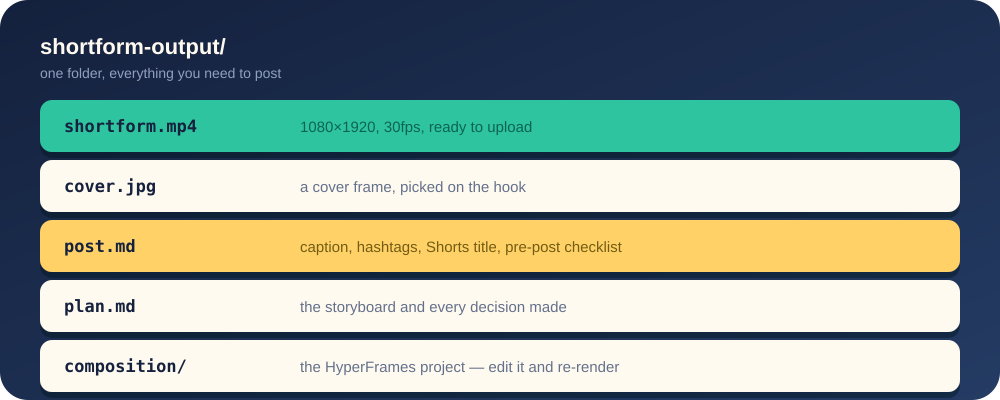
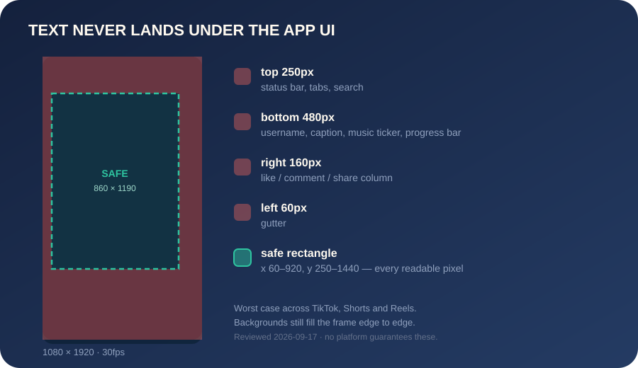
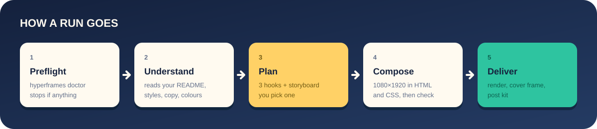

# 📱 /shortform

**Your project, as a video the scroll doesn't survive.**

One line in your terminal. One vertical video, ready to post.

[](https://github.com/virtucon/shortform/actions/workflows/validate.yml)
[](LICENSE)
[](https://agentskills.io)

<p align="center"></p>

<p align="center">
  
</p>
<p align="center"><sub><code>/shortform attract freelancers as customers, TikTok, 25 seconds</code> · <a href="examples/paidly/shortform-output/shortform.mp4">watch with sound</a> · <a href="examples/paidly/shortform-output/post.md">read post kit</a></sub></p>

The thumb owes you nothing. It has scrolled past better projects than yours today and it did not read your landing page. You get one frame to change its mind — so the hook is on frame 1, the captions carry the whole message with the sound off, and nothing readable sits where TikTok draws its own buttons.

## 🚀 Quick start

```bash
npx skills add virtucon/shortform
```

Then, from your project root:

```
/shortform
```

No prompt needed. It reads your project and asks one question — **“What should this video achieve, and for whom?”** — then comes back with three hooks and a storyboard. Pick one and it renders while you do something else.

| I use | I type |
|---|---|
| Claude Code, Cursor | `/shortform` |
| Codex | `$shortform` |
| Gemini CLI, OpenCode, others | “use shortform” |

Free, MIT, runs on your machine. No flags, no timeline, no stock footage, no watermark, no AI avatar. When there is a project to read, the video is built from your real UI, colours and copy.

**Status: early.** v0.2.1 — works end to end, tested on a handful of projects. Please report the rough edges.

## 📊 The receipts

Every number here comes from the skill, not from a pitch deck.

| | |
|---|---|
| Canvas | 1080×1920, 30fps |
| Length | 20–30s by default, **30s hard cap** |
| Objective playbooks | 8 — attract customers, drive signups, grow followers, educate, announce a launch, social proof, hire, community |
| Hooks offered | 3, each written to a different pattern |
| Questions you answer | 1 |
| Something changes on screen | every 2–3 seconds |
| Smallest headline type | 110px, max 8 words, max 3 lines |
| Bundled music | 4 tracks, all CC0 |
| Written per run | `shortform.mp4`, `cover.jpg`, `post.md`, `plan.md`, `composition/` |
| Accounts, services, binaries | 0 |

## 🎁 What you get

<p align="center"></p>

A full checked-in run: [`examples/paidly/`](examples/paidly) → [plan](examples/paidly/shortform-output/plan.md) · [video](examples/paidly/shortform-output/shortform.mp4) · [cover](examples/paidly/shortform-output/cover.jpg) · [post kit](examples/paidly/shortform-output/post.md).

When it finishes it offers one re-roll — a different hook, length or track. Or open the hood and edit it yourself:

```bash
cd shortform-output/composition
npm run dev                      # live preview in the browser
npx hyperframes@0.8.46 render --quality delivery --fps 30 --output ../shortform.mp4
```

## ✍️ Optional: give it a brief

Plain words after the command. Entirely optional.

```
/shortform attract B2B customers for my invoicing app
/shortform 15 second TikTok, get devs to star the repo
/shortform announce the launch, use the screen recording in ./media/demo.mov
/shortform teach people how compound interest works (no project, just this)
```

Say `just do it` to skip the approval step.

<details>
<summary><b>Everything a brief can set</b></summary>

| You can set | Example | If you don't |
|---|---|---|
| Objective | "attract customers", "get signups", "hire a designer" | it asks one question |
| Platform | "TikTok", "Shorts", "Reels" | one video, safe for all three |
| Length | "15 seconds" | 20–30s (30s is the cap; a longer request is capped and the plan says so) |
| Call to action | "CTA: join the waitlist" | chosen to fit the objective |
| Tone | "deadpan", "premium", "playful" | inferred from your project |
| Your media | "use ./media/demo.mov" | UI is rebuilt from your code |
| Music | "chill music", "use ./track.mp3", "no music" | a bundled track matched to the tone |
| Voiceover | "with voiceover" | off; captions carry the message |

</details>

## 📦 Install

<details>
<summary><b>Claude Code, Codex, Cursor, Gemini CLI, OpenCode, Copilot, or by hand</b></summary>

**Claude Code**

```
/plugin marketplace add virtucon/shortform
/plugin install shortform@shortform
```

**Everything else**

```bash
npx skills add virtucon/shortform
```

Add `-g` to install for every project. The [`skills` CLI](https://github.com/vercel-labs/skills) puts it in the right folder for each agent it finds.

**By hand**: copy `skills/shortform/` into your agent's skills folder (`~/.claude/skills/`, `~/.agents/skills/`, or whatever your agent reads).

</details>

<details>
<summary><b>What you need installed</b></summary>

- [Node.js](https://nodejs.org) 22 or newer
- [FFmpeg](https://ffmpeg.org/download.html) (with `ffprobe`) on your `PATH`
- Chrome, which renders the frames: `npx hyperframes@0.8.46 browser ensure`
- A few GB of free disk — frames are extracted before the MP4 is written
- In Docker on Linux: `--shm-size=512m` — Chrome needs about 256MB of `/dev/shm` and the default is 64MB
- Only for voiceover: the Kokoro TTS model, which `hyperframes doctor` reports and links. Without it the run offers to build captions-only.
- The [HyperFrames](https://github.com/heygen-com/hyperframes) skills, which do the rendering:

  ```bash
  npx hyperframes@0.8.46 skills update hyperframes-core hyperframes-animation hyperframes-creative hyperframes-keyframes hyperframes-cli
  ```

The skill runs `hyperframes doctor` first and tells you what is missing and the command that fixes it. It never installs anything itself.

**One caveat about that dependency.** `/shortform` pins the HyperFrames CLI to `0.8.46`, but the HyperFrames *skills* above install from the upstream repository's `main` branch — there is no version to pin, and nothing records which state you got. Upstream changes can therefore change how your videos come out with no change in this repository. The pin here is raised deliberately, one pull request at a time; the skills underneath move on their own.

</details>

## 📐 Why it survives the scroll

A landscape demo cropped to 9:16 dies in a feed. The apps draw their own UI over your video, and they do not care what you put there:

```
     1080 × 1920                    ← 60px          160px →
  ┌────────────────────────┐
  │ ▓▓▓▓ search · tabs ▓▓▓ │  250px   platform UI. Your text here
  │ ▓▓▓▓▓▓▓▓▓▓▓▓▓▓▓▓▓▓▓▓▓▓ │          is a text you never sent.
  │┄┄┌──────────────────┐┄┄│
  │  │                  │  │
  │  │   HOOK ON        │  │         safe rectangle
  │  │   FRAME 1        │  │         860 × 1190
  │  │                  │  │         x 60–920, y 250–1440
  │  │   ▁▁▁▁▁▁▁▁▁▁     │  │
  │  │   ▁▁▁▁▁▁▁        │  │         everything readable
  │  │                  │  │         lives in here
  │  │   ONE CTA        │  │
  │  │                  │  │
  │┄┄└──────────────────┘┄┄│
  │ ▓▓ @username ▓▓▓▓▓▓ ▓▓ │  480px   caption, music ticker,
  │ ▓▓ caption ▓▓▓▓▓▓▓▓ ▓▓ │          like/comment/share, and
  │ ▓▓▓▓▓▓▓▓▓▓▓▓▓▓▓▓▓▓▓▓▓▓ │          the progress bar
  └────────────────────────┘
```

Margins are the worst case across TikTok, Shorts and Reels, rounded up — a floor that ages, not a platform promise. Seen text sitting under the UI? Send a screenshot and the numbers go up.

<p align="center"></p>

<details>
<summary><b>The eight rules it plans to</b></summary>

- **Objective first.** Eight playbooks (attract customers, drive signups, grow followers, educate, announce a launch, social proof, hire, build community), each with its own hook style, scene structure and call to action.
- **The hook is on frame 1.** No logo sting, no fade in. You pick from three hooks written in three different patterns.
- **Sound-off first.** Big kinetic captions carry the whole message. Music adds energy; it is never needed to understand the video.
- **Safe zones.** Every readable element stays clear of the username, caption, buttons and progress bar the apps draw over your video.
- **Phone-sized type.** Minimum sizes, word limits per card, and hold times so text can be read.
- **Something changes every 2–3 seconds,** and cuts snap to the beat where the track has one. Read time wins over beat sync when they disagree; `plan.md` records which cuts snapped.
- **One call to action, then a loop.** The last frame cuts cleanly into the first, so rewatches count.
- **Nothing made up.** Every claim and number on screen is traced to your project or your brief in `plan.md`.

</details>

## 🔧 How it works

<p align="center"></p>

<details>
<summary><b>Stage by stage</b></summary>

1. **Preflight** — runs the HyperFrames doctor and stops if anything a render needs is missing.
2. **Understand** — reads your README, landing page, styles and core flow for real copy, colours and fonts, straight from the files. No browser, no screenshots of your app.
3. **Plan** — picks the playbook, writes three hooks and a storyboard, and asks you once.
4. **Compose** — builds a 1080×1920 [HyperFrames](https://hyperframes.heygen.com/) composition in HTML and CSS, with captions and music, and runs `hyperframes check`.
5. **Deliver** — renders, verifies size and length, picks the cover, and writes the post kit.

</details>

The skill is plain Markdown: a short [`SKILL.md`](skills/shortform/SKILL.md) and one [reference file](skills/shortform/references) per stage, loaded only when needed. No binary, no service, no account. Read it, change it, fork it — that is the point.

## 🙋 FAQ

<details>
<summary><b>Does it post for me?</b></summary>

No. It makes the file and the copy. You upload.

</details>

<details>
<summary><b>Can I use a trending sound?</b></summary>

Yes. Upload the video, add the sound in the app, and turn the original audio down. Or say "no music" in the brief.

</details>

<details>
<summary><b>Does it work without a project?</b></summary>

Yes. Give it a topic and it makes a typographic video from your brief alone.

</details>

<details>
<summary><b>Will it overwrite my last video?</b></summary>

No. If `shortform-output/` exists, the next run writes `shortform-output-YYYY-MM-DD-HHmmss/`.

</details>

<details>
<summary><b>Which models work?</b></summary>

One that can follow a multi-step skill, write HTML, **and look at images**. The safe-zone gate before rendering works by viewing snapshot frames — a text-only model gets through it blind and will sooner or later put your caption under the TikTok UI. Stronger models make better-looking videos.

</details>

<details>
<summary><b>Is the music safe to post?</b></summary>

Yes. The four bundled tracks are [CC0](skills/shortform/assets/music/CREDITS.md) (public domain).

</details>

## 🤝 Contributing

Issues and pull requests welcome — most of all "this video came out wrong" reports with the brief and a screenshot. See [CONTRIBUTING.md](CONTRIBUTING.md).

Found something exploitable rather than something ugly? See [SECURITY.md](SECURITY.md) and report it privately.

## 🙏 Credits

- Inspired by [brag](https://github.com/latent-spaces/brag) by Shunit Haviv Hakimi, which showed how good a one-command project video can be.
- Rendering by [HyperFrames](https://github.com/heygen-com/hyperframes).
- The example composition animates with [GSAP](https://gsap.com) and sets type in [Space Grotesk](https://github.com/floriankarsten/space-grotesk), both bundled under their own licences, not MIT.
- Music by Of Far Different Nature, omfgdude, Emma_MA and congusbongus, via [OpenGameArt](https://opengameart.org), all CC0.

## ⚖️ License

[MIT](LICENSE) for the skill. Bundled fonts, music and libraries keep their own licences — see [THIRD_PARTY_NOTICES.md](THIRD_PARTY_NOTICES.md).
